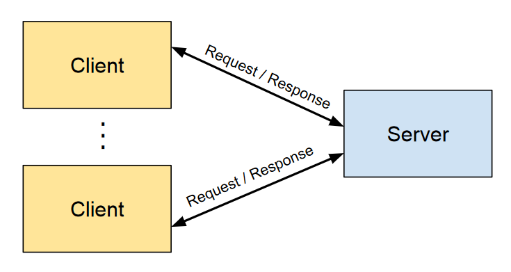

# Client-Server Architectures 

> **Client-Server Architecture** is a network-based design paradigm were 
> multiple client devices request and receive services or resources 
> from **centralized server** systems. 

This separation allows clients to handle user interfaces and interactions, 
while servers manage data processing, storage, and business logic.

* **Client**: The component that initiates requests for services or 
    resources. It typically handles the user interface and user experience.

* **Server**: The component that processes client requests, manages resources, 
    and provides the requested services or data.

## Benefits of Client-Server Architectures

* **Scalability**:

    * **Horizontal Scaling**: Servers can be scaled out by adding more 
        machines to handle increased load.
   
    * **Vertical Scaling**: Enhancing server capabilities (e.g., more CPU, 
        memory) to manage higher demands.

* **Maintainability**:

    * **Centralized Management**: Servers can be updated, maintained, and 
        secured centrally without requiring changes to clients.
   
    * **Modular Updates**: Changes in server-side logic do not necessitate 
        client-side modifications, provided interfaces remain consistent.

* **Security**:

    * **Centralized Security Controls**: Implementing security measures 
        (authentication, authorization, encryption) on servers ensures 
        consistent protection of data and resources.

    * **Data Protection**: Sensitive data can be stored and managed on 
        secure servers rather than distributed across clients.

* **Resource Optimization**:
    
    * **Efficient Resource Use**: Servers can optimize resource allocation, 
        manage database connections, and handle intensive computations.

    * **Reduced Client Burden**: Clients can remain lightweight, focusing 
        on user interface and experience without handling complex processing 
        tasks.

## References

* Martin Fowler. 
    **Patterns of Enterprise Application Architecture**. 
    Addison Wesley, 2003

*Egon Teiniker, 2020-2025, GPL v3.0*