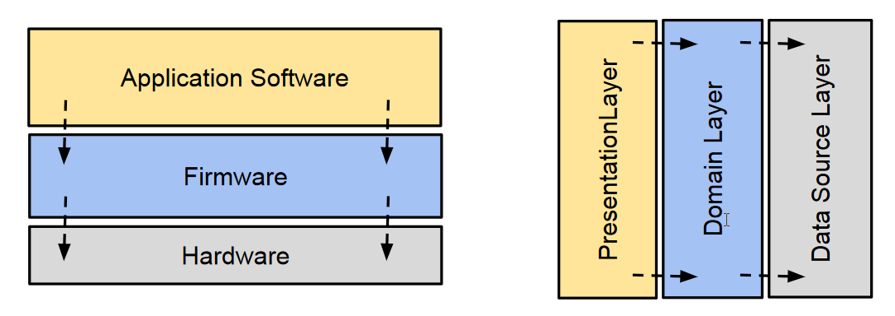

# Layered Architectures

> **Layered Architecture** (N-Tier) structures a software application into multiple 
> layers (tiers), each serving a particular role within the system. 
> Typically, these layers are organized in a linear sequence, where **each 
> layer interacts only with the layer directly above or below it**. 

This hierarchical arrangement ensures a clear separation of concerns, 
making the system easier to manage and evolve.

N-Tier implies that the architecture can have any number of layers (tiers), 
but commonly, applications use a **three-tier** or four-tier setup.

## Benefits of Layered Architectures

* **Separation of Concerns**: Each layer has a distinct responsibility, 
    making the system easier to understand, develop, and maintain.

* **Modularity**: Layers can be developed, tested, and debugged independently, 
    facilitating parallel development and reducing complexity.

* **Ease of Testing**: Layers can be tested in isolation using unit tests, 
    integration tests, and other testing methodologies, ensuring higher quality 
    and reliability.

* **Maintainability**: Changes in one layer (e.g., switching the database 
    technology) have minimal impact on other layers, simplifying maintenance 
    and upgrades.

## Practical Example

In the **embedded systems** domain, layered architecture is widely applied to manage 
complexity and improve maintainability. 

* **Layer 1: Hardware Abstraction Layer (HAL)**
    * Provides an interface between the hardware and software.
    * Manages device-specific operations, such as reading sensors or controlling actuators.
    * Abstracts the specifics of the microcontroller and peripherals.

    * Components:
        * Drivers for sensors (e.g., temperature, humidity).
        * Drivers for actuators (e.g., HVAC control relays, fans).
        * Communication protocols (e.g., SPI, I2C, UART).

* **Layer 2: Firmware/Platform Layer**
    * Manages the operating system (if present) and system-level services.
    * Provides reusable modules for tasks like scheduling, logging, and power management.

    * Components:
        * Real-Time Operating System (RTOS) or lightweight task scheduler (e.g., FreeRTOS).
        * Power management modules to control energy usage.
        * Drivers for non-critical peripherals (e.g., LCD screen or buttons).

* **Layer 3: Application Layer**
    * Implements the main control logic and decision-making processes.
    * Processes data from sensors and issues commands to actuators.
    * Ensures system behavior adheres to user-defined rules and configurations.    

    * Components:
        * Control algorithms for temperature regulation (e.g., PID control).
        * Logic for operating modes (e.g., "Energy-Saving Mode," "Comfort Mode").
        * Communication protocols for user commands (e.g., Wi-Fi or Bluetooth handlers). 

* **Layer 4: User Interaction Layer**
    * Interfaces with the end-user or other systems for configuration and control.
    * Displays system status or takes user inputs.
    * Provides connectivity for remote control or monitoring.

    * Components:
        * LCD screen and buttons for local user interaction.
        * Wireless communication modules (e.g., Wi-Fi, Zigbee).
        * APIs for mobile app or cloud integration.

## References 

* Buschmann, Meunier, Rohnert, Sommerlad, Stal. 
    **Pattern-Oriented Software Architecture, Volume 1**, 
    Wiley, 1996

* Robert C. Martin, 
    **Clean Architecture: A Craftsman's Guide to Software Structure and Design**.
    Addison-Wesley, 2017
    * Chapter 29: Clean Embedded Architecture

*Egon Teiniker, 2020-2025, GPL v3.0*