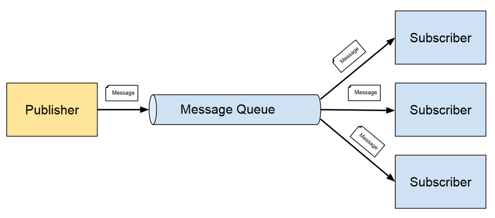

# Message-Oriented Architectures

> **Message-Oriented Architecture (MOA)** is an architectural pattern where 
> components communicate exclusively through the **exchange of messages**. 
> These messages can represent commands, requests, or data payloads that 
> trigger specific actions or transactions within the system. 

The primary focus is on reliable and structured communication between 
producers (senders) and consumers (receivers) using messaging systems 
or middleware like **message queues** or **brokers**.

## Benefits of Message-Oriented Architectures

* **Scalability**:

    * **Horizontal Scaling**: Both producers and consumers can scale 
    independently based on the volume of messages.

    * **Load Balancing**: Messaging systems distribute messages evenly 
    among available consumers, preventing bottlenecks.

* **Flexibility and Loose Coupling**:

    * **Independent Development**: Producers and consumers can be developed, 
        deployed, and updated independently.

    * **Technology Agnosticism**: Components can use different technologies 
    and platforms as long as they adhere to the messaging protocol.

* **Asynchronous Processing**:

    * **Non-Blocking Operations**: Producers do not wait for consumers to 
    process messages, allowing for more efficient resource utilization.

    * **Improved Responsiveness**: Systems can handle high loads without 
    degrading performance, as processing can occur in the background.

* **Support for Complex Workflows**:

    * **Event-Driven Processing**: Enables the implementation of sophisticated 
    workflows and business processes through event chaining and orchestration.

## References

* Gregor Hohpe, Bobby Woolf. 
    **Enterprise Integration Patterns: Designing, Building, and Deploying Messaging Solutions**.
    Addison Wesley, 2003

*Egon Teiniker, 2020-2025, GPL v3.0*