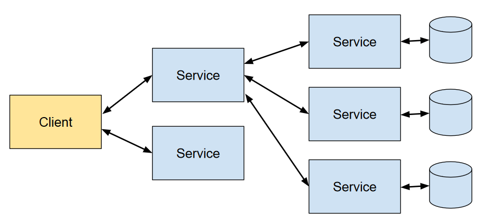

# Microservices

> **Microservices Architecture** is an architectural style that structures 
> an application as a suite of small services, each running in its own process 
> and communicating with lightweight mechanisms, typically **HTTP/REST** or 
> **messaging queues**. 

Each microservice is focused on executing a single function or business capability, 
ensuring high cohesion and low coupling within the system.

## Benefits of Microservices Architectures

* **Scalability**:
    
    * **Independent Scaling**: Services can be scaled individually based on 
    their specific load and performance requirements.

    * **Optimized Resource Use**: Resources can be allocated more efficiently, 
    targeting only the services that need scaling.

* **Flexibility in Technology Stack**:
    
    * **Polyglot Programming**: Different services can use different programming 
    languages, frameworks, and technologies best suited for their functionality.

    * **Ease of Innovation**: Teams can adopt new technologies for specific services 
    without impacting the entire system.

* **Faster Time-to-Market**:

    * **Parallel Development**: Multiple teams can work on different services 
    simultaneously, accelerating development cycles.

    * **Continuous Deployment**: Enables frequent updates and deployments without 
    significant downtime.

* **Enhanced Maintainability and Manageability**:

    * **Codebase Size**: Smaller, manageable codebases per service simplify 
    understanding, debugging, and maintenance.

    * **Clear Boundaries**: Well-defined service boundaries promote better 
    organization and responsibility allocation.

## References

* Martin Fowler: [**Microservices**](https://martinfowler.com/articles/microservices.html) 

* Sam Newman. 
    **Building Microservices: Designing Fine-Grained Systems**.
    O'Reilly, 2nd Edition, 2021

*Egon Teiniker, 2020-2025, GPL v3.0*