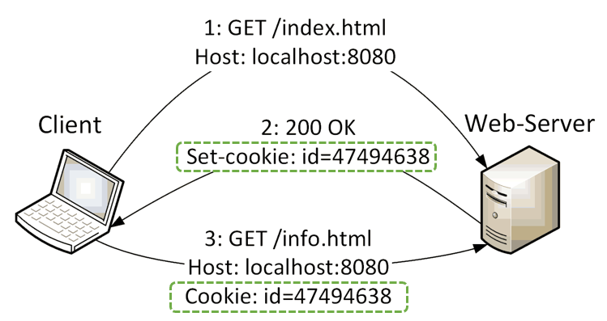

# HTTP Protocol 

## Introduction

Web browsers, servers, and related web applications all talk to each other through 
the **Hypertext Transfer Protocol (HTTP)**

HTTP is the common language of the global Internet.
Because HTTP uses **reliable data-transmission protocols** (TCP), it guarantees that 
the data will not be damaged or scrambled in transit.

Web content lives on web servers. Web servers speak the HTTP protocol, they are 
also called **HTTP servers**. 


The **HTTP clients** send **requests** to servers, and servers return the requested 
data in HTTP **responses**.


## Media Types

HTTP carefully tags each object being transported through the Web with a data 
format label called a **Multipurpose Internet Mail Extension (MIME)** type.

A MIME type is a **textual label**, represented as a primary object type and 
a specific subtype, separated by a slash.

_Examples:_ Common MIME types
* text/html
* text/plain
* image/gif 


## Uniform Resource Locator

A **Uniform Resource Locator (URL)** describes the specific location of a 
resource on a particular server.

Most URLs follow a standardized format of three main parts:

* The first part of the URL is called the **scheme**, and it describes 
    the protocol used to access the resource. 
    
    _Examples:_ `http://`, `https://`, `ftp://`, `file://`

* The second part gives the server **internet address**.

    _Example:_ `www.webshop.com`

* The rest names a **resource** on the web server. 

    _Example:_ `/specials/book.gif`


## Architectural Components of the Web

Besides web browsers and web servers, there are many other web 
applications that we interact with on the Internet:

* **Proxies**: HTTP intermediaries that sit between clients and servers.

* **Caches**: HTTP storehouses that keep copies of popular web pages 
    close to clients.

* **Gateways**: Special web servers that connect to other applications.

* **Tunnels**: Special proxies that blindly forward HTTP communications.

* **Agents** :Semi-intelligent web clients that make automated HTTP requests.

_Example:_ **Interception Proxy**


## HTTP Messages

HTTP supports different request commands (**HTTP methods**):  

* **GET**: Send a named resource from the server to the client.

* **PUT**: Store data from client into a named server resource.

* **DELETE**: Remove the named resource from a server.

* **POST**: Send client data into a server gateway application.

* **HEAD**: Send just the HTTP headers from the response for the 
    named resource.

In regular web applications, **GET and POST requests are mainly used**. 
GET requests query web pages, POST requests submit data from HTML 
forms to the server.

HTTP response messages comes back with a **status code**.

_Examples:_ Common status codes 
* `200 OK`       - Document returned correctly.
* `302 Redirect` - Go someplace else to get the resource.
* `404 Not Found` - Can’t find this resource.

HTTP messages consist of three parts:

* **Start line**: The first line of the message indicates what to do 
    for a request or what happened for a response.

* **Header fields**: Zero or more header files follow the start line. 
    Each header file consists of a name and a value, separated by a 
    colon `:` The headers end with a blank line.

* **Body**: The message body is optional and can contain any kind 
    of data. Request bodies carry data to the Web server, response 
    bodies carry data back to the client.

_Example:_ HTTP Request
```http
GET /Application/index.html HTTP/1.1\r\n
Host: localhost:8080\r\n
User-Agent: Mozilla/5.0 (X11; Linux i686; rv:5.0) Gecko/20100101 Firefox/5.0\r\n
Accept: text/html,application/xhtml+xml,application/xml;q=0.9,*/*;q=0.8\r\n
Accept-Language: en,en-us;q=0.5\r\n
Accept-Encoding: gzip, deflate\r\n
Accept-Charset: ISO-8859-1,utf-8;q=0.7,*;q=0.7\r\n
Connection: keep-alive\r\n
Referer: http://localhost:8080/Application/\r\n
\r\n
```

_Example:_ HTTP Response
```http
HTTP/1.1 200 OK\r\n
Server: Apache-Coyote/1.1\r\n
Content-Type: text/html;charset=ISO-8859-1\r\n
Content-Length: 140\r\n
Date: Fri, 03 Feb 2018 10:33:20 GMT\r\n
\r\n
<html>  
    <head>    
        <title>Application Title</title>  
    </head>  
    <body>    
        <h1>Welcome to this Web application!</h1>    
    </body>
</html>
\r\n
```

## HTTP Headers

Headers and methods work together to determine what clients and servers do.

Headers fall into five main classes:

* **General headers**: 	
    These are generic headers used by both clients and servers.
    
    _Example:_ `Date: Tue, 3 Oct 2019 02:16:00 GMT`

* **Request headers**:
	They provide extra information to servers.
    
    _Example:_ `Accept: text/html`

* **Response headers**:	
    They provide information to the client.
    
    _Example:_ `Server: WildFly/17`

* **Entity headers**:
    Refer to headers that deal with the entity body.
    
    _Example:_ `Content-Type: text/html; charset=UTF-8`
    
* **Extension headers**:
    Extension headers are nonstandard headers that have been created 
    by application developers.


## HTTP Cookies

Cookies define new **HTTP headers** and are the best current way to 
identify users and allow persistent sessions. 

We can classify cookies into two types:

* **Session cookies** are temporary cookies that keeps track of settings 
    and preferences as a user navigates a site. A session cookie is deleted 
    when the user exits the browser.

* **Persistent cookies** can live longer - they are stored on disk and survive 
    browser exits and computer restarts.



1. The first time a user visits a web site, the web server sticks a unique 
    cookie onto the user so it can identify this user in the future.

2. The cookie is attached to the user using the **Set-Cookie** HTTP response 
    headers. 
    
    Cookies can contain any information, but they often contain just a unique 
    identification number, generated by the server for tracking purposes.
    The server adds a cookie (id=“47494638") the response message. 
    
    The browser remember the cookie contents, storing the set of cookies in 
    a **browser cookie database**.
    
3. When the user returns to the same site in the future, the browser will 
    select those cookies stuck to the user by the server and pass them back 
    in a **Cookie request header**.

Cookies let the browser accumulate a set of server-specific information, 
and provide this information back to the server each time it visits 
a site - **client-side state**.


## References

* David Gourley, Brian Totty. **HTTP – The Definitive Guide**. O’REILLY, 2002

* Andrew S. Tanenbaum. **Computer Networks**: Prentice Hall, 4th Edition, 2003 

* [RFC 2616: Hypertext Transfer Protocol (HTTP/1.1)](http://www.w3.org/Protocols/rfc2616/rfc2616.html)

* [RFC 7540: Hypertext Transfer Protocol Version 2 (HTTP/2)](https://tools.ietf.org/html/rfc7540)


*Egon Teiniker, 2020-2025, GPL v3.0*
