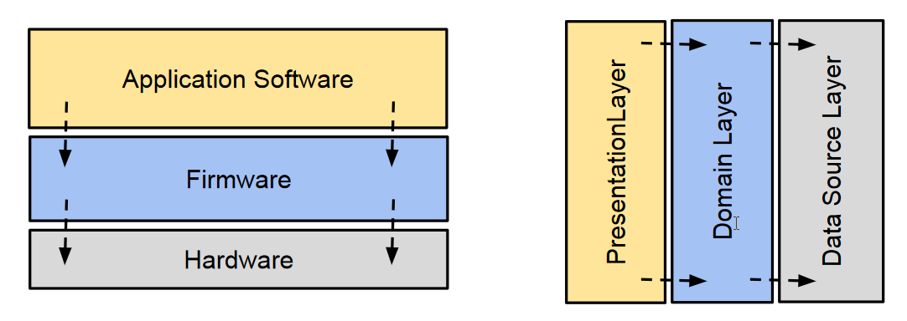

# Layered Architectures

> **Layered Architecture** (N-Tier) structures a software application into multiple 
> layers (tiers), each serving a particular role within the system. 
> Typically, these layers are organized in a linear sequence, where **each 
> layer interacts only with the layer directly above or below it**. 

This hierarchical arrangement ensures a clear separation of concerns, 
making the system easier to manage and evolve.

N-Tier implies that the architecture can have any number of layers (tiers), 
but commonly, applications use a **three-tier** or four-tier setup.

## Benefits of Layered Architectures

* **Separation of Concerns**: Each layer has a distinct responsibility, 
    making the system easier to understand, develop, and maintain.

* **Modularity**: Layers can be developed, tested, and debugged independently, 
    facilitating parallel development and reducing complexity.

* **Ease of Testing**: Layers can be tested in isolation using unit tests, 
    integration tests, and other testing methodologies, ensuring higher quality 
    and reliability.

* **Maintainability**: Changes in one layer (e.g., switching the database 
    technology) have minimal impact on other layers, simplifying maintenance 
    and upgrades.

## Example: ESP32 Software Stack

When we build an application for the ESP32 using the **Arduino development framework**, 
we are actually leveraging a stack of software layers underneath our own code. 

Here is how these layers typically look, from lowest (closest to the hardware) to highest 
(where your user application code runs):

### 1. ESP32 Hardware

This is the actual **silicon**: the microprocessor (Tensilica Xtensa cores 
on the ESP32, **RISC-V** on ESP32-Cx), memory, peripherals (UART, SPI, Wi-Fi, Bluetooth, 
etc.), and GPIOs.

All other software layers ultimately communicate with the real hardware 
registers and peripherals of the SoC (system on a chip).  

### 2. FreeRTOS 

FreeRTOS is a popular, open-source Real-Time Operating System (RTOS) designed specifically for microcontrollers and small embedded systems. It provides a lightweight kernel that manages task scheduling, allowing you to break your application into independent, concurrent threads (tasks) rather than writing a single super-loop.

As an ESP-IDF component it includes scheduler, tasks, queues, 
semaphores, timers, ISR-to-task handoff, etc. 

### 3. Espressif IoT Development Framework (ESP-IDF)

The ESP-IDF is Espressif’s official, **low-level SDK for programming the ESP32**. 
It is the base software stack that provides **drivers**, **Wi-Fi and Bluetooth stacks**, 
and other core functionalities.

It provides APIs to configure and control ESP32 peripherals (PWM, I2C, SPI, Wi-Fi, etc.).  

### 3. Arduino Core for ESP32

The **Arduino Core for ESP32** is essentially a wrapper or adaptation layer built on 
top of ESP-IDF. It allows Arduino code (with its familiar functions like `setup()`, 
`loop()`, `pinMode()`, `digitalWrite()`, etc.) to run on the ESP32.

* It translates standard Arduino function calls into equivalent ESP-IDF functions.  
* It includes board definitions, pin mappings, default configurations, and initialization 
    routines specific to various ESP32 boards.  
* It keeps the Arduino API consistent with the typical Arduino C++ environment.  

### 4. Arduino Sketch

This is our application (`.ino` file) or your C++ source code, which we write in the Arduino 
IDE (or other environments like PlatformIO).  

In standard Arduino style, we implement a `setup()` function (runs once) and a `loop()` 
function (runs repeatedly).

* Our code directly calls Arduino API functions (e.g., `pinMode()`, `digitalWrite()`, 
    `WiFi.begin()`, etc.).  
* At compile time, our code is linked with the Arduino libraries, which themselves 
    rely on ESP-IDF.  
* Once compiled and uploaded, our application code runs on the ESP32 hardware.  

This layered architecture lets us write simple Arduino-style sketches, while under 
the hood it benefits from the robust and feature-rich platform provided by the ESP-IDF.

## References 

* Buschmann, Meunier, Rohnert, Sommerlad, Stal. 
    **Pattern-Oriented Software Architecture, Volume 1**, 
    Wiley, 1996

* Robert C. Martin, 
    **Clean Architecture: A Craftsman's Guide to Software Structure and Design**.
    Addison-Wesley, 2017
    * Chapter 29: Clean Embedded Architecture

* [Arduino core for the ESP32, ESP32-P4, ESP32-S2, ESP32-S3, ESP32-C3, ESP32-C6 and ESP32-H2](https://github.com/espressif/arduino-esp32)

* [ESP32 Arduino Core’s documentation](https://docs.espressif.com/projects/arduino-esp32/en/latest/)

*Egon Teiniker, 2020-2026, GPL v3.0*
