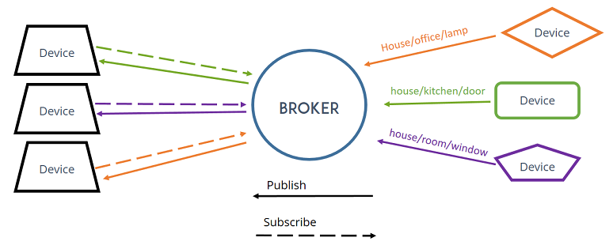

# Introduction to the MQTT Protocol

The MQTT protocol is a **machine-to-machine (M2M)** and IoT connectivity protocol. 

MQTT is a **lightweight messaging protocol** that works with a server-based 
publish-subscribe mechanism and **runs on top of TCP/IP**.

MQTT it is a very interesting option whenever we have to send and receive data 
in **near-real time**.

The MQTT is better suited for a scenario in which **many devices have to exchange 
data between themselves in near-real time** over the internet and we need to consume 
the least network bandwidth possible. 

This protocol works better than HTTP 1.1 and HTTP/2 when unreliable networks are 
involved and connectivity is intermittent.


## Publisher-Subscriber Pattern
In the publish-subscribe pattern, a client that publishes a message is decoupled 
from the other client or clients that receive the message.



The publish-subscribe pattern requires a server, also known as a broker. 
All the clients establish a connection with the server. 
A client that sends a message through the server is known as the **publisher**. 

The server filters the incoming messages and distributes them to the clients that 
are interested in that type of received messages. 
Clients that register to the server as interested in specific types of messages are 
known as **subscribers**.

A **topic** is a named logical channel, and it is also referred to as a channel or 
subject. The server will send subscribers only messages published to topics to which 
they are subscribed.

The data for a message is known as the **payload**. A message includes the topic to 
which it belongs and the payload.

The publisher-subscriber architecture results in the following properties:
* Publishers and subscribers are **decoupled in space** because they don't know each other. 
* Publishers and subscribers are **decoupled in time** because don't have to run at the same time. 
    The publisher can publish a message and the subscriber can receive it later. 
* The publish operation isn't synchronized with the receive operation.

The publisher can **send a message as an asynchronous operation** to avoid being blocked 
until the server receives the message.

A publisher that requires sending a message to hundreds of clients can do it with a 
single publish operation to a server.

Because publishers and subscribers are decoupled, the publisher doesn't know whether any 
subscriber is going to listen to the messages it is going to send.


## Message Filtering

Consider that **each message belongs to a topic**. 

When a publisher requests the server to publish a message, it must specify both 
the topic and the message. The server receives the message and delivers it to all 
the subscribers that have subscribed to the topic to which the message belongs.

The server doesn't need to check the payload for the message to deliver it to the 
corresponding subscribers. It just needs to check the topic for each message that 
has arrived and needs to be filtered before publishing it to the corresponding subscribers.

**A subscriber can subscribe to more than one topic**.
The server has to make sure that the subscriber receives messages that belong to all 
the topics to which it has subscribed.


## MQTT Connection

The **MQTT server** (broker) is the central hub of the publish-subscribe model. 
The MQTT server is responsible for the authentication and authorization of the 
MQTT clients that will be able to become publishers and/or subscribers after 
they are authenticated and authorized. 

So, the first thing that an MQTT client must do is to establish a connection 
with the MQTT server.

After a successful connection has been established between an MQTT client and an 
MQTT server, the server will keep the connection open until the client loses the 
connection or sends a DISCONNECT control packet to the server to close the connection.


## Using Command-Line to Learn How MQTT Works

Mosquito comes with commandline clients that we can use to try out MQTT.

### Subscribing to topics

We will use the **mosquitto_sub** command-line utility included in Mosquitto 
to generate a simple MQTT client that subscribes to a topic and prints all the 
messages it receives.
```
$ mosquitto_sub  -t sensors/distance -d

Client (null) sending CONNECT
Client (null) received CONNACK (0)
Client (null) sending SUBSCRIBE (Mid: 1, Topic: sensors/distance, QoS: 0, Options: 0x00)
Client (null) received SUBACK
Subscribed (mid: 1): 0
```

Parameters:
* `-t`: Topic the client subscribes to
* `-d`: Debugging mode 
* `-V` mqttv311: Version number 
* `-h localhost` 

The Terminal window will display messages published to the topic to which we subscribed 
as they arrive from the MQTT server to the MQTT client.

The client sends PINGREQ packets to the MQTT server and receives PINQRESP packets 
from the MQTT server.
```
Client (null) sending PINGREQ
Client (null) received PINGRESP
```

### Publishing messages

We will use the **mosquitto_pub** command-line utility included in Mosquitto to 
generate a simple MQTT client that publishes a message to a topic.

```
$ mosquitto_pub -t sensors/distance -m  "10cm" -d
Client (null) sending CONNECT
Client (null) received CONNACK (0)
Client (null) sending PUBLISH (d0, q0, r0, m1, 'sensors/distance', ... (4 bytes))
Client (null) sending DISCONNECT
```

Parameters:
* `-t`: Topic the client subscribes to
* `-m`: Message
* `-d`: Debugging mode 
* `-V mqttv311`: Version number 
* `-h localhost` 

The previous command will create an MQTT client that will establish a connection with 
the local MQTT server and then will make the client publish a message to the topic 
specified after the `-t` option.

After publishing the message, the client disconnects.


## Best Practices for Topics

A publisher always has to specify the topic name to which a message will be published. 
The easiest way to understand topic names in MQTT is to think about them as paths in a 
file system.

Instead of saving files in a path, we can think about publishing a message to a path 
and using the same mechanism we use to organize files in paths to arrange messages in 
topics.

Instead of directories or folders, a topic has **topic levels**, specifically a hierarchy 
of topic levels, and slashes (/) are used as delimiters, that is, topic-level separators.
**Topic names are case-sensitive**.

_Example:_ device/sensors/distance

We can use any UTF-8 character in topic names, with the exception of the two wildcard 
characters that we will analyze later: the plus sign (+) and hash (#). 
Hence, we must avoid + and # in the topic names.

We should avoid creating topics starting with the dollar sign `$` because many MQTT 
servers publish statistics data related to servers in topics that start with `$`.

We must maintain consistency when sending messages to different topic names as we do 
when we save files in different paths.
We have to take into account that we can subscribe to multiple topics by using topic 
filters, and therefore it is very important to create topic names accordingly.


## Logging Data From Embedded Systems: MQTT vs. HTTP 

When comparing HTTP and MQTT for logging data from an embedded system, 
it's important to consider several factors such as efficiency, power 
consumption, network reliability, data payload size, and the specific 
requirements of the application. 

* **Efficiency and Bandwidth Usage**:
    * HTTP: This is a request-response protocol that can be more 
    bandwidth-intensive. It is not as efficient for frequent, small 
    messages because of the overhead involved in setting up and 
    tearing down each connection.
    * MQTT: A lightweight publish/subscribe messaging protocol, designed 
    for low-bandwidth, high-latency networks. MQTT is more efficient for 
    frequent and small messages due to its minimal protocol overhead.

* **Quality of Service (QoS)**:
    * HTTP: Offers a basic level of reliability with acknowledgments for 
    received messages. However, it doesn't have built-in support for 
    different levels of QoS.
    * MQTT: Provides three levels of QoS for message delivery ("At most once", 
    "At least once", and "Exactly once"). This makes it a more reliable choice 
    for ensuring data is logged accurately.

* **Network Reliability**:
    * HTTP: More sensitive to network interruptions. In an unstable network, 
    HTTP can be less reliable due to its stateless nature.
    * MQTT: Better suited for unstable or low-quality networks. Its keep-alive 
    and clean session features help maintain connection stability and ensure 
    message delivery even in challenging network conditions.

* **Power Consumption**:
    * HTTP: Typically consumes more power because of its higher bandwidth 
    requirements and the need to establish a new connection for each request.
    * MQTT: Designed for constrained devices and networks, hence it generally 
    consumes less power. It's more suitable for devices running on battery or 
    limited power sources.

* **Use Case Specifics**:
    * Real-time Monitoring: MQTT is generally better for real-time monitoring due 
    to its low latency.
    * Large Payloads: HTTP may be more suitable for larger payloads or where the 
    interaction model fits the request-response pattern.

In summary, if your embedded system requires efficient, low-power communication 
for small, frequent messages in potentially unreliable networks, MQTT is likely 
the more effective choice. 

If your system deals with larger data payloads, less frequent communication, or 
integrates directly with HTTP-based web services, HTTP might be more suitable. 

The final decision should be based on the specific needs and constraints of your 
embedded system project.


## Setup Mosquitto Server (Linux)

```Bash
$ sudo apt update
$ sudo apt install mosquitto mosquitto-clients
```

```Bash
$ sudo systemctl status mosquitto
mosquitto.service - Mosquitto MQTT Broker
     Loaded: loaded (/lib/systemd/system/mosquitto.service; enabled; preset: enabled)
     Active: active (running) since Wed 2024-01-03 17:33:14 CET; 18s ago
```

Don't start Mosquitto MQTT Message Broker automatically when the Linux boots
```Bash
$ sudo systemctl disable mosquitto
// $ sudo systemctl enable mosquitto     // default setting 

$ sudo systemctl start mosquitto
$ sudo systemctl stop mosquitto
```
The Mosquitto server will work with **TCP port 1883**.


## References
* Gaston C. Hillar.
	**Hands-On MQTT Programming with Python: Work with the lightweight IoT protocol in Python**.
	Packt Publishing, Kindle-Version, 2018

* [GitHub: Hands-On MQTT Programming with Python](https://github.com/PacktPublishing/Hands-On-MQTT-Programming-with-Python)

* [What is MQTT and How It Works](https://randomnerdtutorials.com/what-is-mqtt-and-how-it-works/)

* [Enterprise Integration Patterns](https://www.enterpriseintegrationpatterns.com/)

*Egon Teiniker, 2020-2025, GPL v3.0*