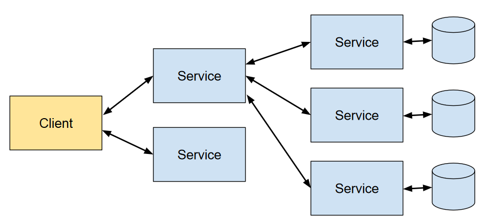

# Microservices

> **Microservices Architecture** is an architectural style that structures 
> an application as a suite of small services, each running in its own process 
> and communicating with lightweight mechanisms, typically **HTTP/REST** or 
> **messaging queues**. 

Each microservice is focused on executing a single function or business capability, 
ensuring high cohesion and low coupling within the system.




## Benefits of Microservices Architectures

* **Scalability**:
    
    * **Independent Scaling**: Services can be scaled individually based on 
    their specific load and performance requirements.

    * **Optimized Resource Use**: Resources can be allocated more efficiently, 
    targeting only the services that need scaling.

* **Flexibility in Technology Stack**:
    
    * **Polyglot Programming**: Different services can use different programming 
    languages, frameworks, and technologies best suited for their functionality.

    * **Ease of Innovation**: Teams can adopt new technologies for specific services 
    without impacting the entire system.

* **Faster Time-to-Market**:

    * **Parallel Development**: Multiple teams can work on different services 
    simultaneously, accelerating development cycles.

    * **Continuous Deployment**: Enables frequent updates and deployments without 
    significant downtime.

* **Enhanced Maintainability and Manageability**:

    * **Codebase Size**: Smaller, manageable codebases per service simplify 
    understanding, debugging, and maintenance.

    * **Clear Boundaries**: Well-defined service boundaries promote better 
    organization and responsibility allocation.


## Example: RESTful APIs

In his PhD thesis, **Roy Fielding** identified a set of architectural principles 
called **REpresentational State Transfer (REST)**.


## Addressability
Addressability is the idea that every object and resource in our system is 
reachable through a unique identifier.

In the REST world, addressability is managed through the use of URIs.

_Example:_ 
```
http://localhost:8080/REST-Service/users/3
```
Using a unique URI to identify each of our services makes each of our 
resources linkable.

## Uniform, Constrained Interface
REST uses only the finite set of operations of the HTTP application protocol 
(HTTP methods) where each method has a specific purpose and meaning.

* **GET**: This is a **read-only** operation. It is used to query the server 
	for specific information. 
  	It is an **idempotent** (no matter how many times we apply the operation, 
	the result is always the same) and **safe** (invoking a GET does not 
	change the state of the server at all) operation.

* **PUT**: This method requests that the server store the message body sent 
	with the request under the location provided by in the HTTP message. 
	It is also **idempotent**.

* **DELETE**: This method is used to remove resources. It is **idempotent** 
	as well.

* **POST**: This is the only **nonidempotent and unsafe** operation of HTTP. 
	Each POST method is allowed to modify the service in a unique way.

* **HEAD**: This method is exactly like GET except that instead of returning a 
	response body, it returns only a response code and any headers associated 
	with the request.

* **OPTIONS**: This method is used to request information about the communication 
	operations of the resource we are interested in.

There are other HTTP methods (like TRACE and CONNECT), but they are unimportant 
when designing RESTful services.

Advantages of constraining the interfaces:
* **Familiarity**: If we have a URI that points to a service, we know exactly 
	which methods are available on that resource.
* **Interoperability**: HTTP is a very well known protocol. Most programming 
	languages have an HTTP client library available to them.
* **Scalability**: Because REST constrains us to a well-defined set of methods, 
	we have predictable behavior that can have massive performance benefits 
	(e.g. using caches).

## Representation-Oriented

Each service is addressable through a specific URI and representations are exchanged 
between the client and service.

These representations could be **XML**, **JSON**, **YAML**, or any format we can 
come up with.

The representation is the message body of a HTTP request or response. 
HTTP uses the **Content-Type header** to tell the client or server what data format 
it is receiving. With the **Accept header**, a client can list its preferred response 
formats.

## Communicate Statelessly

Stateless means that there is no client session data stored on the server. 
The server only records and manages the state of the resources it exposes.

If there is a need for session-specific data, it should be held and maintained 
by the client and transferred to the server with each request as needed.

A service that does not have to maintain client sessions is a lot easier 
to scale, without expensive replications in a clustered environment.


## HATEOAS

Hypermedia is a document-centric approach with the added support for embedding 
links to other services. Hyperlinks allow us to reference and aggregate 
additional data without bloating our responses.

In **Hypermedia As The Engine Of Application State**, with each request returned 
from a server it tells us what new interaction we can do next, as well as where 
to go to transition the state of our applications. 


## References
* Roy Thomas Fielding. **Architectural Styles and the Design of Network-based Software Architectures**.
	University of California, Irvine, 2000

* Martin Fowler: [Microservices](https://martinfowler.com/articles/microservices.html) 

* Martin Fowler: [Richardson Maturity Model - Steps toward the glory of REST](http://martinfowler.com/articles/richardsonMaturityModel.html)

* Sam Newman. 
    **Building Microservices: Designing Fine-Grained Systems**.
    O'Reilly, 2nd Edition, 2021

*Egon Teiniker, 2020-2026, GPL v3.0*