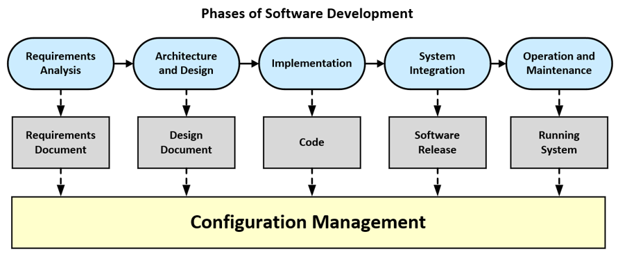
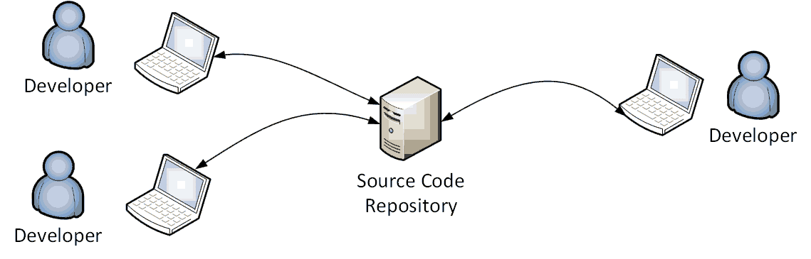
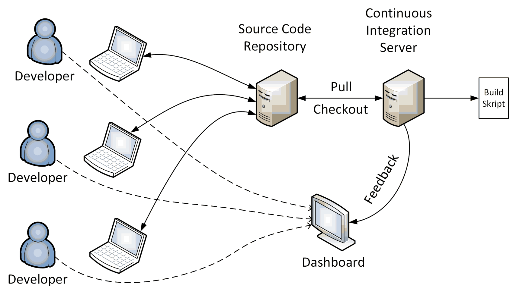

# Introduction to Configuration Management 

## Phases of Software Development

Regardless of which process model you use for software development, the following phases of 
software development must always be completed.

In every phase we need configuration management techniques:

* **Requirements Analysis**: The functional and non-functional requirements as well as existing 
    framework conditions are defined in discussion with the customer.
    
    The result of the requirement analysis are use case specifications, which are summarized 
    in a **requirement document**.

* **Architecture and Design**: The structure of the software system is defined. Abstraction 
    divides the overall functionality into components that interact through specified interfaces 
    and protocols. 
    
    Architectural and design decisions are captured in the **design document**, which usually 
    also contains UML diagrams.

* **Implementation**: The functionalities of the components are further subdivided until they 
    can be implemented with the constructs of a programming language. Every part of the 
    implementation is verified by automated tests. 
    
    The result of this phase is the **source code** as well as various **configuration files** 
    and **software libraries**.

* **System Integration**: The software components are integrated, and the software system is 
    checked to see whether it meets its requirements. 
    
    After a successful acceptance test, the software system (**software release**) is 
    delivered to the customer. 

* **Operation and Maintenance**: This is by far the longest phase in the life cycle of a software 
    product. The software has been installed and is in use as a running system. 
    
    Maintenance activities **eliminate bugs** that have not been discovered by then. 
    This phase also includes the addition of **new functionalities** as requirements change 
    over time - **Software Evolution**.

## Configuration Management

> **Configuration management (CM)** refers to the process by which all artifacts relevant 
> to a project, and the relationships between them, are stored, retrieved, uniquely 
> identified, and modified.

Successful configuration management includes at least the following activities:

* [**Version Control**](https://github.com/teiniker/teiniker-lectures-computerscience/tree/master/configuration-management/versioning)

    Version control systems are a mechanism for **keeping multiple versions
    of our files**, so that when we modify a file, we can still access the 
    previous revisions.

    A version control system:
    * Retains, and provides access to, **every version of every file** that has 
        ever been stored in it. 
    * Provides **metadata** (information that describes the data stored) attached 
        to single files or collections of files. 
    * Allows teams that may be distributed across space and time to **collaborate**.	

    

* [**Build Automation**](building/cmake/)
    
    Having a **common project layout** is fundamental to successful software 
    development. It refers to adopting a standardized directory structure and 
    file organization that is widely recognized and utilized within the developer 
    community.

    _See also:_ [Layout of C/C++ projects](building/project-layout/README.md)

    Getting the sources turned into a running system involves compilation, moving 
    files around, loading schemas into the databases, and so on. 
    Typing in commands or clicking through dialog boxes is a waste of time and 
    a breeding ground for mistakes. These tasks should be automated.

    _See also:_ [Steps of a C/C++ build process](building/build-steps/)

    Tools for automated builds are a common feature of systems. The C/C++ world has 
    had **GNU make** for decades and uses **CMake** these days. 

    Make sure we can build and launch our system using these tools in a single command.

    _See also:_ [C/C++ compiler flags](building/compiler-flags/)
    
* [**Test Automation**](testing/)
    
    A compiled program may run, but that doesn't mean it does the right thing. 
    A good way to catch bugs more quickly and efficiently is to **include automated 
    tests in the build process**. 

    **Testing isn't perfect**, but it can catch a lot of bugs - enough to be useful. 

    **Extreme Programming (XP)** and **Test-Driven Development (TDD)** have 
    done a great deal to popularize self-testing code and as a result many 
    people have seen the value of the technique.

* [**Generative AI**](generative-ai/README.md)

    Generative AI is increasingly transforming software development by enhancing 
    the traditional **pair programming model**. Pair programming involves two developers 
    working collaboratively on the same codebase, typically with one writing code 
    (the "driver") and the other reviewing and providing guidance (the "navigator").

## Continuous Integration

> **Continuous Integration (CI)** is a software development practice where members 
> of a team integrate their work frequently, usually each person integrates at least 
> daily – leading to multiple integrations per day. 

Each **integration is verified by an automated build (including test)** to 
detect integration errors as quickly as possible.

1. A **developer commits code** to the version control repository. 
2. The CI server detects that changes have occurred in the version control 
    repository, so the **CI server retrieves the latest copy of the code** 
    from the repository and **executes a build script**. 
3. The CI server generates **feedback** (HTML reports, emails) for project 
    members.
4. The **CI server continues to poll for changes** in the version control 
    repository.

**Benefits of Continuous Integration**:

* The greatest and most wide-ranging benefit of Continuous Integration 
    is **reduced risk**.
* At all times **you know where you are**, what works, what doesn't, the 
    outstanding bugs you have in your system.
* Continuous Integrations doesn't get rid of **bugs**, but it does make 
    them dramatically **easier to find and remove**.
    As a result, projects with Continuous Integration tend to have dramatically 
    **less bugs**, both in production and in process.
* If we have continuous integration, it removes one of the biggest barriers 
    to **frequent deployment**.

**Roadmap to Continuous Integration**:

1. Get everything you need into **source control**.
2. One of the first steps is to get the **build automated**.
3. Introduce some **automated testing** into you build.
4. Try to **speed up** the commit build. 

If we are starting a new project, we **use Continuous Integration from 
the beginning**. 

## References

* Ian Sommerville. **Software Engineering**. Pearson, Global Edition 2015
* Jez Humble, Davis Farley. **Continuous Delivery**. Addison-Wesley, 2010
* Paul M. Duvall. **Continuous Integration - Improving Software Quality and Reducing Risk**. Addison-Wesley, 2007
* Martin Fowler. **Continuous Integration**. http://martinfowler.com/articles

*Egon Teiniker, 2020-2024, GPL v3.0*