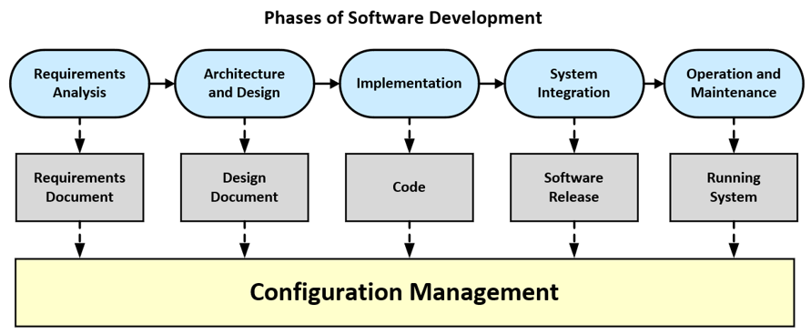

# Introduction to Configuration Management 

> **Configuration management (CM)** refers to the process by which all artifacts relevant 
> to a project, and the relationships between them, are stored, retrieved, uniquely 
> identified, and modified.

Configuration management will also govern **how a team collaborates**.

Although version control systems are the most obvious tool in configuration management, 
the decision to use one is just the first step in developing a configuration management 
strategy.	

## Phases of Software Development

Regardless of which process model you use for software development, the following phases of 
software development must always be completed.

In every phase we need configuration management techniques:

* **Requirements Analysis**: The functional and non-functional requirements as well as existing 
    framework conditions are defined in discussion with the customer.
    
    The result of the requirement analysis are use case specifications, which are summarized 
    in a **requirement document**.

* **Architecture and Design**: The structure of the software system is defined. Abstraction 
    divides the overall functionality into components that interact through specified interfaces 
    and protocols. 
    
    Architectural and design decisions are captured in the **design document**, which usually 
    also contains UML diagrams.

* **Implementation**: The functionalities of the components are further subdivided until they 
    can be implemented with the constructs of a programming language. Every part of the 
    implementation is verified by automated tests. 
    
    The result of this phase is the **source code** as well as various **configuration files** 
    and **software libraries**.

* **System Integration**: The software components are integrated, and the software system is 
    checked to see whether it meets its requirements. 
    
    After a successful acceptance test, the software system (**software release**) is 
    delivered to the customer. 

* **Operation and Maintenance**: This is by far the longest phase in the life cycle of a software 
    product. The software has been installed and is in use as a running system. 
    
    Maintenance activities **eliminate bugs** that have not been discovered by then. 
    This phase also includes the addition of **new functionalities** as requirements change 
    over time - **Software Evolution**.

## References

* Ian Sommerville. **Software Engineering**. Pearson, Global Edition 2015

*Egon Teiniker, 2020-2024, GPL v3.0*