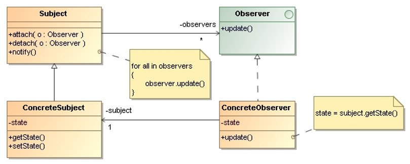
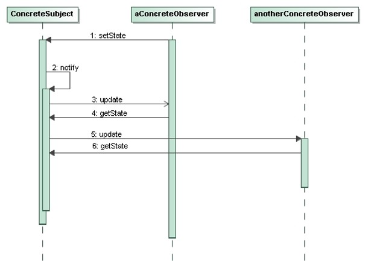

# Observer 

> Define a **one-to-many dependency between objects** so that 
> when one object changes state, all its dependents are notified 
> and updated automatically.

## Applicability

Use the observer pattern when:
* an change to one object requires changing others, and you don’t 
    know how many objects need to be changed. 

* an object should be able to notify other objects without making 
    assumptions about who these objects are.

## Structure

* `Subject`: 
    - Knows its `Observers`. Any number of `Observer` objects may observe a `Subject`.
    - Provides an interface for attaching and detaching `Observer` objects.

* `Observer`:
    - Defines an updating interface for objects that should be notified 
        of changes in a `Subject`.

* `ConcreteSubject`:
    - Stores state of interest to `ConcreteObserver` objects.
    - Sends a notification to its `Observers` when its state changes.

* `ConcreteObserver`: 
    - Maintains a reference to a `ConcreteSubject` object.
    - Stores state that should stay consistent with the `Subject`’s.
    - Implements the `Observer` updating interface to keep its state 
        consistent with the `Subject`’s.

## Collaborations

* `ConcreteSubject` notifies its `Observers` whenever a change occurs that 
    could make its `Observers’` state inconsistent with its own.

* After being informed of a change in the `ConcreteSubject`, a 
    `ConcreteObserver` object may query the subject for information.
    `ConcreteObserver` uses this information to reconcile its state with 
    that of the `Subject`.

## Consequences

* The observer pattern lets us **vary Subjects and Observers independently**: 
    - We can reuse `Subjects` without reusing their `Observers`, and vice versa.
    - It lets us add `Observers` without modifying the `Subject` or other 
        `Observers`.

* The **coupling between subjects and observers is abstract and minimal**:
    - All a `Subject` knows is that it has a list of `Observers`, each conforming 
    to the simple interface of the abstract `Observer` class.
    - The `Subject` doesn’t know the concrete class of any `Observer`.

* Support for **broadcast communication**:
    - The notification that a `Subject` sends need not specify its receiver. 
        The notification is broadcast automatically to all interested `Objects` 
        that subscribed to it.
    - The `Subject` does not care how many interested objects exist. Its only 
        responsibility is to notify its `Observers`. We can add and remove 
        `Observers` at any time.

* There can be **unexpected update costs**:
    - Because `Observers` have no knowledge of each other’s presence, they can 
        be blind to the ultimate cost of changing the `Subject`.

## Implementation Issues

* The push and the pull models:
    - **Push model**: The `Subject` sends observers detailed information about 
        the change, whether they want it or not.
    - **Pull model**: The `Subject` sends nothing but the most minimal notification, 
        and `Observers` ask for details explicitly thereafter.

* **Observing more than one subject**:
    It might make sense in some situations for an `Observer` to depend on more 
    than one `Subject`. It’s necessary to extend the update interface in such 
    cases to let the `Observer` know which `Subject` is sending the notification. 
    The `Subject` can simply pass itself as a parameter in the update operation.

* **Who triggers the update?**:
    - Let state-setting operations on `Subject` call notify after they change 
        the `Subject’s` state.
    - Make clients responsible for calling notify at the right time.

## Examples and Exercises

## References 

* E. Gamma, R. Helm, R. Johnson, J. Vlissides. **Design Patterns, Elements of Reusable Object-Oriented Software**. Addison-Wesley, 1995
    * Chapter 5: Behavioral Patterns

*Egon Teiniker, 2024-2025, GPL v3.0*