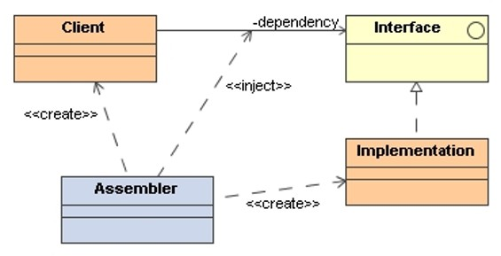

# Dependency Injection

> **Dependency Injection (DI)** is a design pattern in which an object’s 
> **required dependencies are provided (injected) from the outside** 
> rather than being created internally, allowing objects to rely on 
> abstractions rather than concrete implementations.

The dependency is typically passed through a constructor, method parameter, 
or framework/injector.

## Applicability

Use Dependency Injection when:

* WE want to **separate object creation from object usage** - Inversion of Control (IoC).
* We want to **reduce coupling** between components.
* We need to easily **replace implementations** (e.g., mock objects 
    for testing).
* We **expect the system to grow**, requiring flexible component swapping.
* A class depends on **external resources** (services, databases, APIs, 
    configuration).

## Structure

### Participants:

* **Client**: Needs a service to function.

* **Service (Interface + Implementation)**: The actual functionality being used.

* **Assembler (IoC Container)**: Creates and supplies dependencies to clients.

## Collaborations

* The **Client** declares a dependency on an abstraction (e.g., interface 
    or base class).

* The **Assembler** determines which concrete implementation to create.

* The **Service** is created externally and passed into the Client.

* At runtime, the Client communicates with the injected Service through 
    the abstract interface, not the concrete class.

This enables **swapping implementations** (real, mocked, cached, remote, etc.) 
**without modifying Client code**.

## Consequences

#### Benefits:

* **Loose coupling** between classes. Clients don’t construct dependencies.
* **Improved testability** (mock or stub services easily).
* **Greater flexibility & scalability** (swap implementations at runtime).
* **Cleaner, more maintainable code**, single responsibility is enforced.
* **Easier configuration** in large systems (often via DI containers).

#### Drawbacks:

* Can introduce **complexity** when using advanced DI frameworks or IoC containers.
* Harder to trace control flow—object graph is not explicitly created in client code.
* Overuse can lead to many small interface abstractions.

## Implementation Issues

Forms of injection:

* **Constructor Injection**: Dependency passed through constructor.

* **Setter Injection**: Dependency set after object creation via setter methods.

* **Interface Injection**: Client exposes method for receiving dependency.

## Other Design Patterns

When we compare the Dependency Injection Pattern with other Design Patterns, the following 
differences in functionality and application emerge.

### Dependency Injection vs. Factory Method

#### Purpose:

* **Dependency Injection**: Externalizes object creation: dependencies are given to an object.

* **Factory Method**: Encapsulates object creation within a subclass, letting subclasses 
    decide which concrete class to instantiate.

#### Use Cases:

* **Dependency Injection**:
    - Swapping implementations at runtime.
    - Unit testing with mocks or stubs.
    - Configurable behavior without changing code.
    - Reducing coupling in layered architectures.

* **Factory Method**:
    - Creating objects based on dynamic conditions.
    - Object creation with additional logic.
    - Avoiding direct dependency on concrete classes.

## References

* Martin Fowler: [**Inversion of Control Containers and the Dependency Injection Pattern**](https://martinfowler.com/articles/injection.html). 2004 
* Robert C. Martin. **Clean Architecture: A Craftsman's Guide to Software Structure and Design**. Addison-Wesley, 2017

*Egon Teiniker, 2025, GPL v3.0*