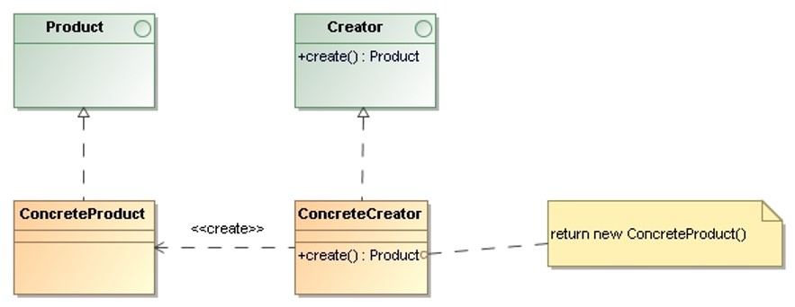

# Factory Method

> Define an **interface for creating an object, but let the subclasses decide which class to instantiate**. 
> Factory Method lets a class defer instantiation to subclasses.

## Applicability

* A class can’t anticipate the class of objects it must create.

* Classes delegate responsibility to one of several helper subclasses, and you want 
    to localize the knowledge of which helper subclass is the delegate.

## Structure

* `Product`: Defines the interface of objects.

* `ConcreteProduct`: Implements the `Product` interface.

* `Creator`: Declares the factory method, which returns an object of type `Product`.
    May also define a default implementation of the factory method that returns a default `ConcreteProduct` 
    object.

## Consequences

* A potential disadvantage of factory methods is that **clients might have to subclass the Creator class** 
    just to create a particular `ConcreteProduct` object.

* Factory methods are **defined as part of an interface** and are not bound to the implementation 
    class like the constructor.

## Implementation Issues

* The two main **variations** of the factory method pattern are:
    * **Creator** is an **interface** or abstract class.
    * **Creator** is a **concrete class** and provides a default implementation for the factory method.

* The factory method takes a **parameter that identifies the kind of object to create**. All 
    objects the factory method creates will share the `Product` interface. Overriding a parameterized 
    factory method lets you easily and selectively extend or change the products that `Creator` produces.

## Examples and Exercises

* Example: [list-serializer](list-serializer/)

* Exercise: [file-service](file-service-exercise/) ([Model Solution](file-service/))

## References 

* E. Gamma, R. Helm, R. Johnson, J. Vlissides. **Design Patterns, Elements of Reusable Object-Oriented Software**. Addison-Wesley, 1995
    * Chapter 3: Creational Patterns

*Egon Teiniker, 2020-2025, GPL v3.0*
