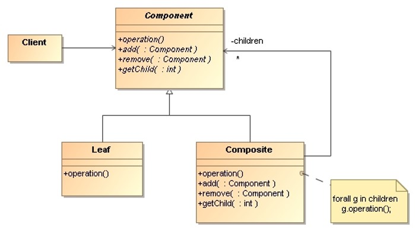

# Composite

> Compose objects into **tree structures** to represent part-whole 
> hierarchies. Composite lets clients treat individual objects and 
> compositions of objects **uniformly**.

## Applicability

* To represent **part-whole hierarchies of objects**.

* To ignore the difference between compositions of objects and individual 
    objects. **Clients will treat all objects in the composite structure 
    uniformly**.

## Structure

* `Component`: 
    * Declares the **interface for objects** in the composition.
    * Implements **default behavior** for the interface common to all classes.
    * Declares an interface for **accessing and managing its child components**.

* `Leaf`:
    * Represents leaf objects (which have **no children**) in the composition.
    * Defines **behavior for primitive objects** in the composition.

* `Composite`:
    * Defines behavior for components **having children**.
    * Store child components.
    * Implements **child-related operations** in the `Component` interface.

* `Client`: **Manipulates objects** in the composition through the `Component` 
    interface.

## Collaborations

* Clients use the `Component` class interface to interact with 
    objects in the composite structure:
    * If the recipient is a `Leaf`, then the request is handled directly.
    * If the recipient is a `Composite`, then it usually **forwards requests 
        to its child components**, possibly performing additional operations 
        before and/or after forwarding.
 

## Consequences

* **Primitive objects can be composed into more complex objects**, which 
    in turn can be composed, and so on recursively. 
* **Clients can treat composite structures and individual objects** uniformly.
    Clients normally don’t know (and shouldn’t care) whether they are dealing 
    with a leaf or a composite object.
* **Newly defined Composite or Leaf subclasses work automatically** with 
    existing structures and client code.
* The disadvantage of making it easy to add new components is that it makes 
    it **harder to restrict the components of a composite**. We will have 
    to use runtime-checks.

## Implementation Issues

* **Explicit parent references**: Maintaining references from child 
    components to their parent can simplify the traversal and management 
    of a composite structure.

* **Maximizing the Component interface**: To make the clients unaware 
    of the specific `Leaf` or `Composite` classes, the `Component` class 
    should define as many common operations as possible for `Composite` 
    and `Leaf` classes. The `Component` class usually provides default
    implementations for these operations, and `Leaf` and `Composite` 
    subclasses will override them.
    
* **Declaring the child management operations**: An important issue in 
    the composite pattern is which class declare these `add()` and `remove()`
    operations for managing children. 

    The decision involves a trade-off between safety and transparency:
    * Defining the child management interface **at the root of the class 
        hierarchy** gives us transparency, because we can treat all components
        uniformly.
    * Defining child management **in the `Composite` class** gives us safety, 
        because any attempt to add or remove objects from leaves will be 
        caught at compile-time.

## Examples

## References 

* E. Gamma, R. Helm, R. Johnson, J. Vlissides. **Design Patterns, Elements of Reusable Object-Oriented Software**. Addison-Wesley, 1995
      * Chapter 4: Structural Patterns

*Egon Teiniker, 2020-2025, GPL v3.0*

