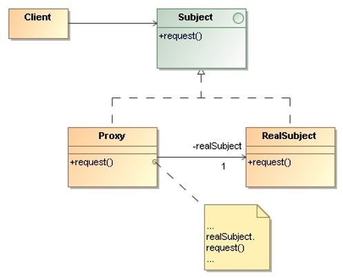
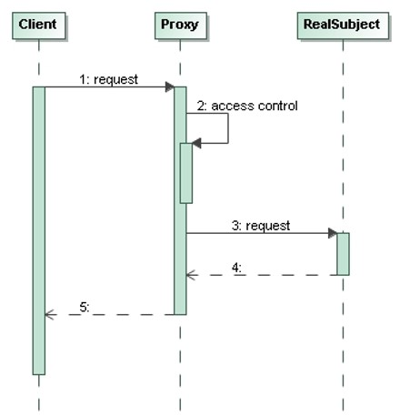

# Proxy

> Provide a surrogate or **placeholder** for another object 
> to **control access** to it.

## Applicability

* `Proxy` is applicable whenever there is a need for a more versatile or 
    **sophisticated reference to an object** than a simple pointer.
 

## Structure

* `Proxy`: 
    * **Maintains a reference** that lets the proxy access the real subject. 
    `Proxy` may refer to a `Subject` if the `RealSubject` and `Subject` 
    interfaces are the same.
    * Provides an **interface identical to `Subject`’s** so that a `Proxy`
    can be substituted for the `RealSubject`.
    * **Controls access** to the `RealSubject` and may be responsible for 
    creating and deleting it.

* `Subject`: Defines the **common interface** for `RealSubject` and `Proxy` 
    so that a `Proxy` can be used anywhere a `RealSubject` is expected.

* `RealSubject`: Defines the **real object** that the `Proxy` represents.

## Collaborations

* **Proxy forwards requests to RealSubject** when appropriate, depending 
    on the kind of proxy.
 

## Consequences

* The proxy pattern introduces a **level of indirection** when accessing 
    an object.

* The additional indirection hay many uses:
    * Both **protection proxies** and **smart references** allow additional
        housekeeping tasks when an object is accessed.
    * A **virtual proxy** can perform optimizations such as creating 
        an object on demand.
    * A **remote proxy** can hide the fact that an object resides in 
        a different address space.

## Implementation Issues

* If a `Proxy` class can deal with its `Subject` solely through an **abstract
    interface**, then there is no need to make a `Proxy` class for each 
    `RealSubject` class – the `Proxy` can deal with all `RealSubject` 
    classes uniformly.

* If `Proxies` are going to **instantiate `RealSubjects`** (such as in a virtual 
    proxy), then they **have to know the concrete class**.
 
## Examples and Exercises

* Example: [user_table](user_table/)

* Exercise: [file-service](file-service-exercise/) ([Model Solution](file-service/))

## References 

* E. Gamma, R. Helm, R. Johnson, J. Vlissides. **Design Patterns, Elements of Reusable Object-Oriented Software**. Addison-Wesley, 1995
    * Chapter 4: Structural Patterns

*Egon Teiniker, 2020-2025, GPL v3.0*

