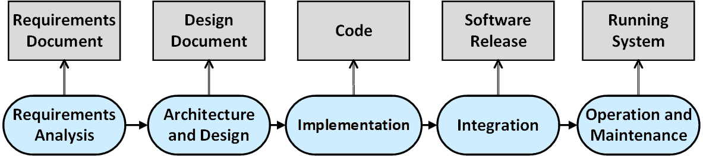
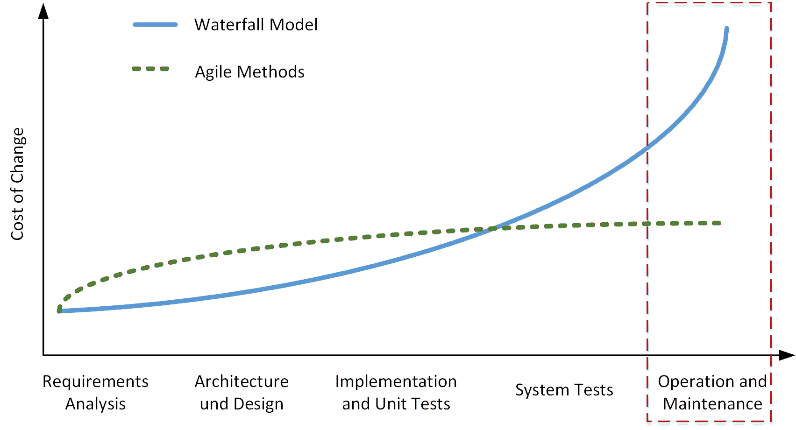

# Introduction to Software Architecture and Design 

## Phases of Software Development

Software development is not just about coding. The software development 
process is divided into several phases, each of which delivers specific 
results.

* **Requirements Analysis**: The **functional and non-functional requirements** 
    as well as existing framework conditions are defined in discussion with the 
    customer. 
    
    The result of the requirement analysis are **use case specifications**, which 
    are summarized in a **requirement document**.

* **Architecture and Design**: The structure of the software system is defined. 
    Abstraction divides the overall functionality into components that interact 
    through specified interfaces and protocols. 
    
    Architectural and design decisions are captured in the **design document**, 
    which usually also contains UML diagrams.

* **Implementation**: The functionalities of the components are further subdivided 
    until they can be implemented with the **constructs of a programming language**. 
    Every part of the implementation is verified by tests. 
    
    The result of this phase is the **source code** as well as various configuration 
    files and software libraries.

* **Integration**: The software components are integrated, and the software system 
    is checked to see whether it meets its requirements. 
    
    After a successful acceptance test, the software system (**software release**) 
    is delivered to the customer. 
    
* **Operation and Maintenance**: This is by far the **longest phase** in the life 
    cycle of a software product. The software has been installed and is in use as 
    a running system. 
    
    Maintenance activities **eliminate bugs** that have not been discovered by then. 
    This phase also includes the **addition of new functionalities** as requirements 
    change over time - **Software Evolution**.
    

## Process Models

Depending on the application, different process models are used to perform the given 
phases of software development.

* If the phases of the process model are distributed **sequentially** over the duration 
    of the project, this is called a **waterfall model** or **V-model**.

* In applications where requirements can change rapidly, agile development methods are 
    used. The project duration is divided into **equal iterations**. In every iteration, 
    all phases of software development are applied.

## Cost of Change 

The common assumptions of software engineering is that the **cost of changing a program 
rises exponentially** over time.

The **operation and maintenance** phase extends over many years for successful software 
systems. This phase also includes **bug fixes** and the **closing of security holes**.

The agile software development community has spent enormous resources trying 
to **reduce the cost of change**: refactoring, better programming languages, better 
databases, better environments and tools,…

## Upfront Design vs. Evolutionary Design    

In software development, two broad approaches to designing system architecture are 
Upfront Design and Evolutionary (Iterative) Design. They represent different ways 
of planning and evolving the architecture across the project lifecycle.

### Upfront Design

> This approach involves extensively designing and documenting the system architecture 
> **before significant coding begins**. 
> It is often associated with more traditional, plan-driven methodologies such as 
> the Waterfall or V-Model model.

* Characteristics:

    * **Comprehensive Early Planning**: Emphasis on complete requirements, 
    architecture, and design documentation from the outset.

    * **Detailed Specifications**: System components, interfaces, data models, 
    and deployment structures are defined in detail early on.

    * **Sequential Progress**: The project proceeds in distinct phases 
    (requirements, design, implementation, testing, deployment), with limited 
    revisiting of earlier phases.

* Advantages:

    * **Predictability**: Having a clear plan helps with cost estimation, 
    resource allocation, and scheduling.

    * **Stable Baseline**: Stakeholders have a common reference for what 
    is being built.

    * **Consistency & Standardization**: Early standards and constraints can 
    enforce a uniform architecture across components.

* Disadvantages:

    * **Inflexibility**: Adapting to changing requirements can be cumbersome 
    if too much is set in stone early.

    * **Over-Engineering**: Architects may spend time perfecting parts of the 
    design that turn out to be unnecessary.

    * **Risk of Incorrect Assumptions**: If initial requirements are 
    misunderstood, there can be costly rework later.

### Evolutionary (Iterative) Design

> This approach designs the system architecture **incrementally and iteratively**, 
> adjusting as new insights emerge. 
> It is closely associated with **Agile methodologies** (e.g., Scrum, XP) and 
> **Continuous Delivery** practices.

* Characteristics:

    * **Incremental Development**: Architecture is refined in small steps 
        (iterations/sprints).

    * **Frequent Feedback**: Continuous involvement of stakeholders, developers, 
        and end-users to adapt the design based on real-world feedback.

    * **Emergent Architecture**: The architecture evolves as requirements become 
        clearer and as technical insights surface during implementation and testing.

* Advantages:

    * **Flexibility & Adaptability**: Easier to accommodate changing requirements 
        without massive rework.

    * **Reduced Upfront Risk**: We invest in detailed design only as it becomes 
        necessary, which can prevent wasted effort.

    * **Immediate Value Delivery**: Working software gets delivered in iterations, 
        proving out design choices quickly.

* Disadvantages:

    * **Risk of Lack of Cohesion**: Without a guiding architectural vision, the 
        design can degrade into ad-hoc components that may become difficult to 
        integrate or maintain.

    * **Technical Debt**: If iterations focus too heavily on new features without 
        periodic refactoring or architectural “housekeeping,” the codebase may 
        decline over time.

    * **Slower Alignment**: Stakeholders used to comprehensive plans might feel 
        less certain about where the project is headed.

### Making a Choice

* **Upfront Design** provides a high degree of initial structure and predictability, 
    but at the cost of flexibility. It works best when requirements are stable and 
    well-understood, or in regulated environments demanding extensive documentation.

* **Iterative Design** thrives on flexibility and feedback, but requires discipline 
    to maintain architectural integrity over time. It excels in dynamic environments 
    where quick adaptations are key.

* Most successful modern projects incorporate some upfront architectural thinking (to 
    address critical constraints) while using iterative cycles to refine and adjust 
    as new information emerges.

## References

* Ian Sommerville. **Software Engineering**. Pearson, Global Edition 2015
* Kent Beck. **Extreme Programming Explained**. Addison-Wesley, 2000

*Egon Teiniker, 2020-2025, GPL v3.0*