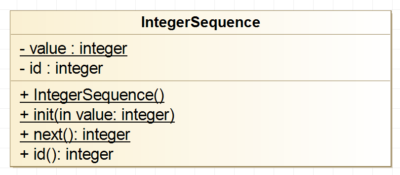

# Integer Sequence - Static Class Members

A class can have static members (attributes and methods) which are 
underlined in the class diagram. 

<p align="center">

</p>

## Static Attributes
A variable that is part of a class, yet is not part of an object of that 
class, is called a static member.
There is exactly one copy of a static member instead of one copy per object, 
as for ordinary non-static members.

```C++
class IntegerSequence 
{
	private:
		static int value_;

    //...
}
``` 
A static data member must be defined in the implementation file *IntegerSequence.cpp*. 
The keyword *static* is not repeated in the definition of a static member.

```C++
int IntegerSequence::value_ = 0;
``` 

## Static Methods

In the same way, we can declare the static methods of a class.
```C++
class IntegerSequence 
{
	//...		
	public:
		static void init(int value);
		static int next(void);
    //...
}
``` 

Again, the keyword *static* is not needed in the implementation file.
```C++
void IntegerSequence::init(int value)
{
	value_ = value;
}

int IntegerSequence::next(void)
{
	return value_++;
}
``` 

A static member can be referred to without mentioning an object. 
Instead, its name is qualified by the name of its class.

```C++
    // Setup
    IntegerSequence::init(1);
    
    // Exercise
    int value1 = IntegerSequence::next();
    int value2 = IntegerSequence::next();
    int value3 = IntegerSequence::next();
    
    // Verify
    CHECK_EQUAL(1, value1);
    CHECK_EQUAL(2, value2);
    CHECK_EQUAL(3, value3);
``` 

## Objects and Static Methods

We can use static members to initialize objects.

```C++
class IntegerSequence 
{
	private:
		static int value_;
		int id_;
				
	public:
		IntegerSequence(void);

		static void init(int value);
		static int next(void); 
		
		int id(void);
 };
 ``` 

In this example, we use the static **next()** method to set the initial value
of the object's member **id**.

```C++
IntegerSequence::IntegerSequence(void)
{
	id_ = IntegerSequence::next();
}
``` 
Thus, every instance of *IntegerSequence* gets its unique id value.

```C++
    // Setup
    IntegerSequence::init(1);
    
    // Exercise
    IntegerSequence obj1 = IntegerSequence();
    IntegerSequence obj2 = IntegerSequence();
    IntegerSequence obj3 = IntegerSequence();
    
    // Verify
    CHECK_EQUAL(1, obj1.id());
    CHECK_EQUAL(2, obj2.id());
    CHECK_EQUAL(3, obj3.id());
``` 


## References
Bjarne Stroustrup. **The C++ Programming Language.** Pearson 4th Edition 2017
* Chapter 16: Classes

[Static Keyword in C++](https://www.geeksforgeeks.org/static-keyword-cpp/)

*Egon Teiniker, 2020, GPL v3.0*
