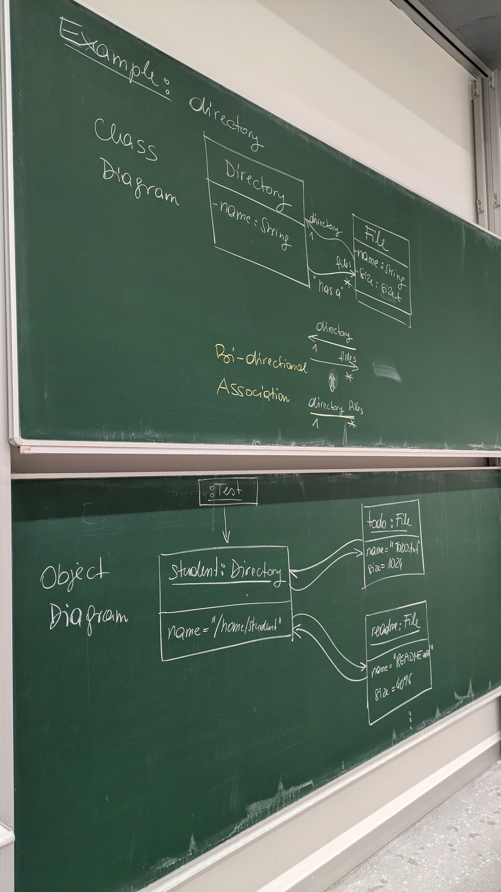

# Example: directory-bidirectional

This chalkboard diagram uses several object-oriented programming (OOP) concepts to represent relationships between entities. Here's an explanation of the concepts presented:

---

### 1. **Classes**
   - **Class Diagram**: The top portion of the board shows a **class diagram**, which is a way of modeling entities and their relationships in OOP.
   - **Classes Defined**:
     - **Directory**:
       - Attribute: `name: String` (indicating that each directory has a name of type String).
     - **File**:
       - Attributes: `name: String` and `size: int` (indicating a file has a name and a size, both defined as attributes).

   **Key Concept**: A **class** is a blueprint for creating objects in OOP. It defines attributes and behaviors (methods) associated with those objects.

---

### 2. **Association**
   - The diagram shows a **bi-directional association** between the `Directory` and `File` classes:
     - A **directory** "has a" file (indicated by the arrow from `Directory` to `File`).
     - Conversely, a **file** "belongs to" a directory (indicated by the arrow from `File` to `Directory`).
   - The notation shows multiplicity:
     - A `Directory` can contain **many** files (`1..*`).
     - A `File` is associated with exactly **one** directory (`1`).

   **Key Concept**: **Association** defines a relationship between classes in OOP. A bi-directional association means both classes are aware of each other's existence.

---

### 3. **Object Diagram**
   - The lower portion of the board shows an **object diagram**, which represents specific instances of classes and their attributes at a given moment.
     - An object of `Directory` (labeled as `student`) with the attribute `name = "/home/student"`.
     - Two objects of `File`:
       1. `todo: File` with attributes `name = "todo.txt"` and `size = 1024`.
       2. `readme: File` with attributes `name = "README.md"` and `size = 64096`.
     - The diagram also indicates how these objects are linked:
       - The `student` directory contains both the `todo` and `readme` files.

   **Key Concept**: An **object** is an instance of a class, with concrete values assigned to its attributes. Object diagrams illustrate these specific instances.

---

### Summary of OOP Concepts in Use:
- **Classes and Objects**: Represented by `Directory` and `File`, and their instances in the object diagram.
- **Attributes**: `name` and `size` as properties of classes.
- **Association**: Bi-directional link between `Directory` and `File`.
- **Object Diagrams**: Showing instances of classes and their relationships.
- **Multiplicity**: Defining the cardinality of relationships.

These diagrams provide a clear example of how OOP principles are applied to model real-world concepts like directories and files in a hierarchical structure.

---
_Generated by ChatGPT4o 2024-11-21_