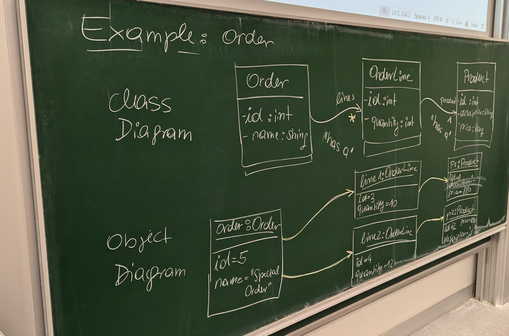

# Example: order-directed

Here's a detailed description of the content from the photo, broken down into the **class diagram** and the **object diagram**:

---

### **Class Diagram**
The **class diagram** represents the structure and relationships between classes in an object-oriented system. The following classes and relationships are visible in the photo:

#### **1. Order Class**
- **Attributes**:
  - `id: int`: Represents the unique identifier of the order.
  - `name: String`: Represents the name or type of the order (e.g., "Special Order").
- **Relationships**:
  - `lines`: A one-to-many relationship (*), indicating that an `Order` can have multiple `OrderLine` objects.

---

#### **2. OrderLine Class**
- **Attributes**:
  - `id: int`: Represents the unique identifier for the order line.
  - `quantity: int`: Represents the quantity of products in the order line.
- **Relationships**:
  - Has a "has-a" relationship with the `Product` class, meaning each `OrderLine` is associated with exactly one `Product`.

---

#### **3. Product Class**
- **Attributes**:
  - `id: int`: Represents the unique identifier for the product.
  - `description: String`: Represents a description of the product.
  - `price: float`: Represents the price of the product.
- **Relationships**:
  - Associated with `OrderLine` through a "has-a" relationship.

---

### **Object Diagram**
The **object diagram** provides specific instances of the classes defined in the class diagram. These represent actual objects with concrete data:

#### **1. Order Object**
- **Instance**: `Order`
  - `id = 5`: The unique identifier of this specific order is 5.
  - `name = "Special Order"`: The name of the order is "Special Order."
- **Relationship**:
  - This order is linked to two `OrderLine` objects (`line1` and `line2`).

---

#### **2. OrderLine Objects**
- **Instance 1**: `line1`
  - `id = 3`: The unique identifier for this order line is 3.
  - `quantity = 10`: This order line includes 10 units of the associated product.
  - Linked to a `Product` object with `id = 1`.

- **Instance 2**: `line2`
  - `id = 4`: The unique identifier for this order line is 4.
  - `quantity = 12`: This order line includes 12 units of the associated product.
  - Linked to a `Product` object with `id = 2`.

---

#### **3. Product Objects**
- **Instance 1**: `P1`
  - `id = 1`: The unique identifier for this product is 1.
  - `description = "A"`: The product description is "A."
  - `price = 880`: The product price is 880.

- **Instance 2**: `P2`
  - `id = 2`: The unique identifier for this product is 2.
  - `description = "B"`: The product description is "B."
  - `price = 290`: The product price is 290.

---

### **Relationships Illustrated**
1. **Order to OrderLine**:
   - The `Order` object with `id = 5` is linked to two `OrderLine` objects (`line1` and `line2`).

2. **OrderLine to Product**:
   - `line1` (id = 3) is linked to `Product` `P1` (id = 1, description = "A", price = 880).
   - `line2` (id = 4) is linked to `Product` `P2` (id = 2, description = "B", price = 290).

---

This separation into **class** and **object diagrams** shows how the abstract definitions (class diagram) are instantiated into specific objects with concrete data (object diagram). This is a core practice in object-oriented modeling to bridge abstraction and real-world application.

---

_Generated by ChatGPT4o 2024-11-21_