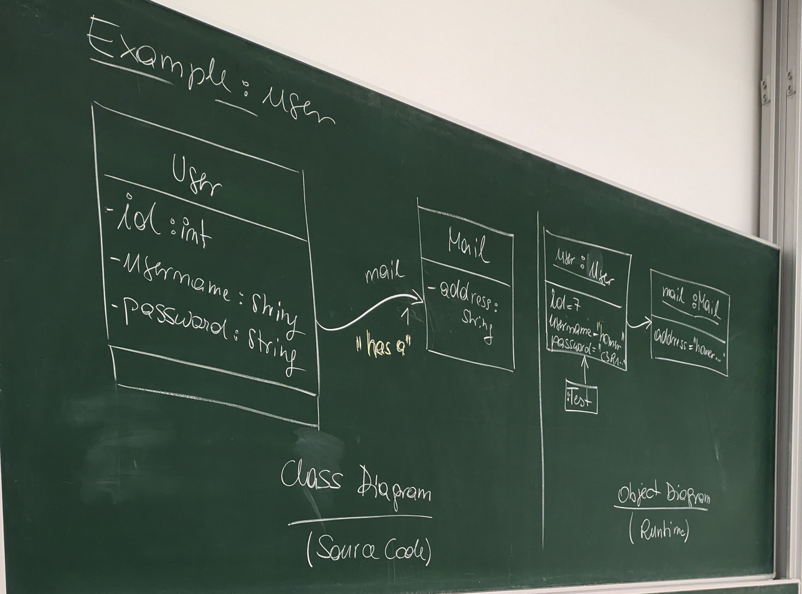

# Example: user-mail-directed

This image illustrates fundamental **Object-Oriented Programming (OOP)** concepts through class and object diagrams. Here’s a breakdown of the concepts shown:

---

### 1. **Class Diagram**
   - Represented in the left and middle sections under "Class Diagram (Source Code)".
   - **Classes**:
     - **`User` class**:
       - Attributes:
         - `id: int`: A unique identifier for the user.
         - `username: string`: Stores the username.
         - `password: string`: Stores the password.
     - **`Mail` class**:
       - Attribute:
         - `address: string`: Stores an email address.

   - **Relationship**:
     - A **"has-a" relationship** between `User` and `Mail` (shown with an arrow labeled "has a").
       - This indicates that a `User` object contains or is associated with a `Mail` object. This is an example of a **directed association**.

   - **Encapsulation**:
     - Attributes in the class (`id`, `username`, `password`, `address`) are encapsulated within the class and are typically accessed or modified through methods (though methods are not explicitly shown in this diagram).

---

### 2. **Object Diagram**
   - Shown on the right side under "Object Diagram (Runtime)".
   - Depicts specific instances (objects) of the `User` and `Mail` classes during runtime:
     - `user: User`:
       - `id = 7`
       - `username = "Tom"`
       - `password = "1234"`
     - `mail: Mail`:
       - `address = "home@..."`

   - **Instantiation**:
     - The objects (`user` and `mail`) are created based on the classes defined in the class diagram.

   - **Association**:
     - The `user` object references the `mail` object. This runtime linkage demonstrates how the `has-a` relationship works in practice.

---

### 3. **Key OOP Concepts Illustrated**
   - **Class vs. Object**:
     - A class is a blueprint (left side), while an object is a specific instance of that blueprint (right side).
   - **Attributes**:
     - Properties of the classes (`id`, `username`, etc.) are defined and then instantiated in objects.
   - **Association**:
     - The arrow labeled "has a" represents an association between the `User` and `Mail` classes, a core concept of OOP.
   - **Encapsulation**:
     - The attributes are enclosed within their respective classes.
   - **Abstraction**:
     - The class diagram abstracts details about `User` and `Mail` while hiding implementation details (methods are not shown).
   - **Composition/Aggregation**:
     - The `Mail` object is tied to the `User` object, demonstrating a structural relationship.

---

_Generated by ChatGPT4o 2024-11-21_