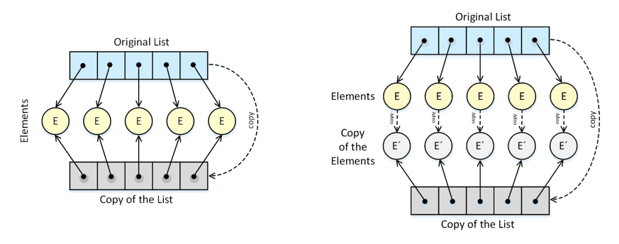

# Copy Constructor

A copy constructor initializes an object using another object of 
the same class type.
		
```C++
    ClassName(const ClassName& original); 
```		

A Copy Constructor may be called in following cases:
* When an object of the class is **passed by value** (to a function) 
    as an argument.
* When an object of the class is **returned by value**.
* When an object is constructed based on another object of the same class.
* When the compiler generates a temporary object.

But it is not guaranteed that a copy constructor will be called in all 
these cases, because the C++ Standard allows the compiler to optimize the 
copy away in certain cases.


## Shallow Copy vs. Deep Copy

If we don’t define our own copy constructor, the C++ compiler creates a 
**default copy constructor** for each class which does a member-wise copy 
between objects.
Default constructor does only **Shallow Copy**.
	 
We need to define our own copy constructor only if an object has pointers 
or any runtime allocation of the resource.



_Figure: Shallow Copy vs. Deep Copy_

**Deep Copy** is possible only with user defined copy constructor. 
In user defined copy constructor, we make sure that pointers (or references) 
of copied object point to new memory locations.
	

## Examples and Exercises

The following examples and exercises are intended to clarify the concept 
of copy constructures and deep copy:

* Example: [user](user/)
* Exercise: [order](order-exercise/) ([Model Solution](order/))


## References
Bjarne Stroustrup. **The C++ Programming Language.** Pearson 4th Edition 2017
* Chapter 3.3: Copy and Move

[Copy Constructor in C++](https://www.geeksforgeeks.org/copy-constructor-in-cpp/)

*Egon Teiniker, 2020-2024, GPL v3.0*
