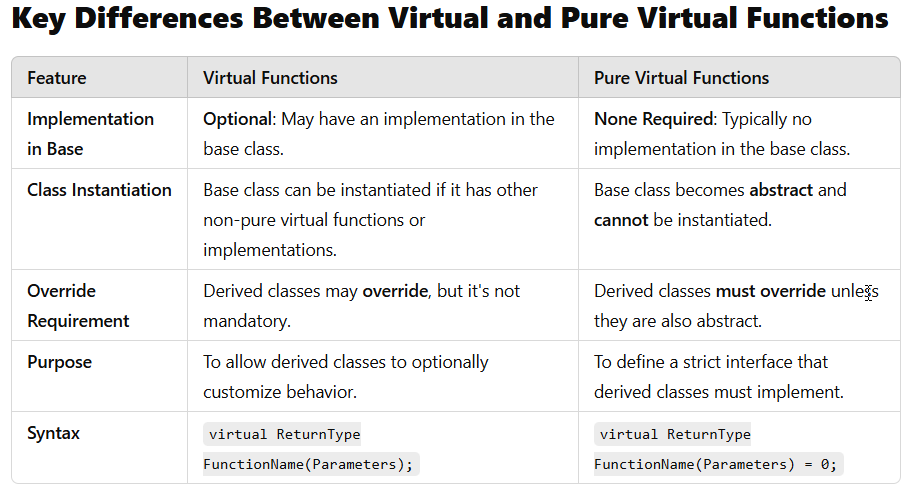

# Inheritance 

Inheritance is a fundamental object-oriented programming (OOP) concept that 
allows a class (known as a **derived class** or child class or **sub class**) 
to acquire properties and behaviors (i.e., data members and member functions) 
from another class (known as a **base class** or parent class or **super class**). 

Inheritance promotes **code reusability**, establishes a natural hierarchy 
between classes, and facilitates **polymorphism**.

The C++ language features support building new classes from existing ones: 

* **Implementation inheritance**: to save implementation effort by sharing 
    facilities provided by a base class 
    
* **Interface inheritance**: to allow different derived classes to be used 
    interchangeably through the interface provided by a common base class. 
    Interface inheritance is often referred to as run-time polymorphism 
    (or dynamic polymorphism).


## Inheritance Access Specifiers

These specifiers determine how members of the base class are accessed 
in the derived class:

* **public**: Public and protected members of the base class retain 
    their access levels in the derived class.

* **protected**: Public and protected members of the base class become 
    protected in the derived class.

* **private**: Public and protected members of the base class become 
    private in the derived class.

In the following examples and explanations we focus on public inheritance.

_Example:_ Base class

```C++  
class Entity 
{
	private:
		int _id; 
 
	public:
		Entity(int id);
		
		int id(void);
 };
```

_Example:_ Derived class 

```C++ 
class Product : public Entity
{
	private:
		std::string _description; 
		long _price;
 
	public:
		Product(int id, const std::string& description, long price); 

		std::string description(void);
		long price(void);
};
```

**Members of a (public) derived class** can use the public and protected 
members of a base class as if they were declared in the derived class itself.

**A derived class cannot access private members of a base class**.


Constructors and destructors are also essential: 

* When a derived class object is created, the **base class constructor is called first**, 
    followed by the derived class constructor.

* **Destructors are called in reverse order**: derived class destructor is called first, 
    followed by the base class destructor.


_Example:_ Constructor implementation of the derived class

```C++
Product::Product(int id, const string& description, long price) 
	: Entity(id), _description{description}, _price{price}
{
}
```

In the given example, the **member initialization list** initializes the base 
class and the member variables of the derived class before the body of the 
constructor is executed.

* `Entity(id)`:
    **Calls the constructor of the base class** `Entity` with id as an argument.
    This ensures that the base class is initialized properly before any derived 
    class-specific initialization occurs.

* `_description{description}` and `_price{price}`:
    **Initializes member variables** with the value of the parameter list.


## Virtual Functions

A virtual function is a **member function in a base class that we expect 
to override in derived classes**. Declaring a function as `virtual` ensures 
that **the most-derived version of the function is called**, even when using 
base class pointers or references.

Characteristics of virtual functions:

* **Dynamic Binding**: Virtual functions support dynamic binding, meaning 
    the call to the function is resolved at runtime based on the actual 
    object type, not the pointer/reference type.

* **Overriding**: Derived classes can override virtual functions to provide 
    specific implementations.

* **Optional Override**: It's not mandatory for derived classes to override 
    virtual functions. If not overridden, the base class's implementation is 
    used.

* **Polymorphism**: Enables polymorphic behavior, allowing objects of different 
    derived classes to be treated uniformly through base class pointers or 
    references.

* **Virtual Destructors**: If a class has virtual functions, its destructor should 
    also be declared virtual to ensure proper cleanup of derived class objects.


## Pure Virtual Functions

A pure virtual function is a virtual function that **must be overridden by 
derived classes**. It **does not provide an implementation in the base class** 
and makes the **base class abstract**, meaning we cannot instantiate objects 
of that class.

_Syntax:_ Abstract class containing pure virtual functions:

```C++
    class Base 
    {
    public:
        virtual void display() = 0; // Pure virtual function
    };
```

Characteristics of abstract classes:

* **Abstract Class**: A class containing at least one pure virtual function 
    becomes an abstract class and cannot be instantiated.

* **Mandatory Override**: Derived classes are required to provide an 
    implementation for pure virtual functions unless they are also abstract.

* **Interface Specification**: Pure virtual functions are often used to define 
    an interface that derived classes must adhere to.



_Example:_ Abstract base class with pure virtual functions

```C++
class Display 
{
	public:
		virtual ~Display(void) {}; 	// Destructor

		// Pure virtual Methods
		virtual void print(char c) = 0;
		virtual void print(const char * c_ptr) = 0;
 };
```

_Example:_ Derived class with overridden pure virtual functions

```C++
class LCD : public Display
{
	private:
		size_t _cols;
		size_t _rows; 		
		size_t _index;
		char* _buffer;
 
	public:
		LCD(size_t cols, size_t rows); 	// Constructor
		~LCD(void); 					// Destructor

		// Accessors
		char* buffer(void) const;

		// Methods
		void clear(void);
		void print(char c) override;
		void print(const char * c_ptr) override;
 };
```

The **override keyword** (introduced in C++11) plays a crucial role 
in enhancing code safety and readability when dealing with virtual 
and pure virtual functions.

`override` is used in a derived class to indicate that a member function 
is intended to **override a virtual function in the base class**. 
It serves as a form of documentation and, more importantly, as a tool 
for the compiler to enforce correct overriding behavior.

C++11 also introduced the `final` keyword, which can be used in conjunction 
with override to **prevent further overriding** in derived classes.


## Examples and Exercises

* **Implementation inheritance** 
    * Demo: [order-inheritance](order-inheritance/)
    * Exercise: [user-inheritance](user-inheritance-exercise/)
        ([Model Solution](user-inheritance))

* **Interface inheritance**
    * Demo: [lcd-inheritance](lcd-inheritance/)


## References
Bjarne Stroustrup. **The C++ Programming Language.** Pearson 4th Edition 2017
* Chapter 20: Derived Classes

*Egon Teiniker, 2020-2024, GPL v3.0*