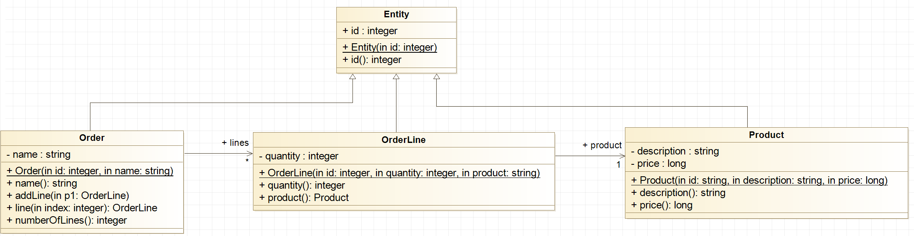

# Example: Order Inheritance

The capability of a class to derive properties and characteristics from 
another class is called Inheritance.
The class that inherits properties from another class is called **Sub-Class**.
The class whose properties are inherited by sub class is called **Base-Class** 
or Super class.

## Implementing Inheritance



Given a base class named `Entity` which implements a common attribute
and its accessor methods.

```C++
class Entity 
{
	private:
		int _id; 
 
	public:
		Entity(int id)
			: _id{id}
		{
		}	
		   
		int id(void)
		{
			return _id;
		}		
 };
```

To create a sub-class, we add **: public Entity** behind the class name
to indicate from which class the **non-private members** are derived.
 
```C++
class Product : public Entity
{
	private:
		string _description; 
		long _price;
 
	public:
		Product(int id, const string& description, long price); 

		string description(void);
		long price(void);
};
 
Product::Product(int id, const string& description, long price) 
	: Entity(id), _description{description}, _price{price}
{
} 
```
Note that we call the **constructor of the base-class** as part of the
implementation of the sub-class constructor. That allows us to initialize 
the attributes of the base-class.


## References
Bjarne Stroustrup. **The C++ Programming Language.** Pearson 4th Edition 2017
* Chapter 20: Derived Classes

[Inheritance in C++](https://www.geeksforgeeks.org/inheritance-in-c/)

[C++ Inheritance](https://www.tutorialspoint.com/cplusplus/cpp_inheritance.htm)

*Egon Teiniker, 2020-2024, GPL v3.0*
