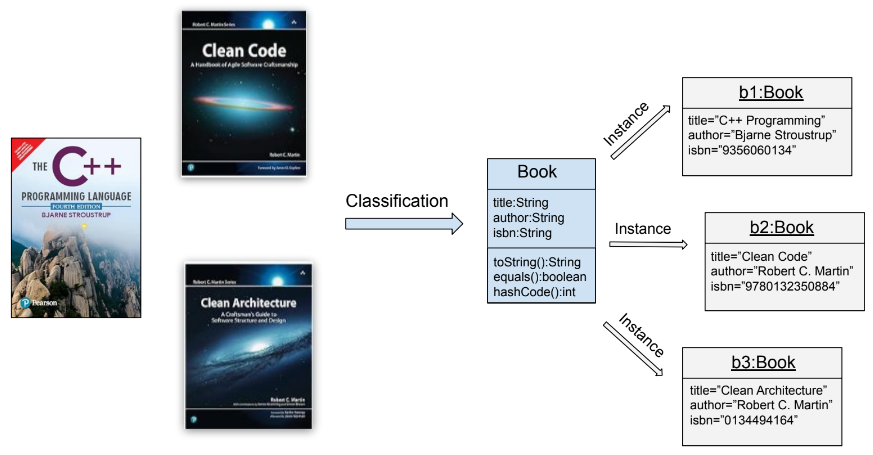

# Object Oriented Programming

## Object Oriented Concepts

Object-oriented programming (OOP) is a programming paradigm that organizes 
software design around objects, which are instances of classes representing 
real-world entities. 

The core concepts of OOP include:

* **Encapsulation**: Bundling data and the methods that operate on that data 
within a single unit (class), and restricting direct access to some of the 
object's components. This promotes data hiding and modularity.

* **Inheritance**: Allowing a new class (subclass) to inherit properties and 
behaviors from an existing class (superclass). This facilitates code reuse 
and the creation of hierarchical relationships between classes.

* **Polymorphism**: Enabling objects of different classes to be treated as 
objects of a common superclass, particularly allowing methods to be overridden 
to provide specialized behavior.

* **Abstraction**: Simplifying complex systems by modeling classes appropriate 
to the problem, focusing on relevant attributes and behaviors while hiding 
unnecessary implementation details.

By leveraging these principles, OOP enhances code reusability, maintainability, 
and scalability, making it easier to manage and develop complex software systems.

## Object Oriented Programming in C++

Object-Oriented Programming plays a fundamental role in C++, distinguishing it 
from its predecessor C by enabling more structured and modular code design. 

In C++, OOP facilitates the creation and management of complex software systems through the following key concepts:

* **Classes and Objects**: 
    **Classes** serve as blueprints for creating objects, encapsulating data 
    (attributes) and functions (methods) that operate on that data. 
    This allows developers to model real-world entities and their interactions 
    within the program.
    **Objects** are instances of classes, enabling the instantiation of multiple 
    entities with similar properties and behaviors.

* **Encapsulation**: 
    Encapsulation in C++ restricts direct access to an object's internal state by 
    using **access specifiers** (private, protected, public). This ensures that 
    the object's data is only modified through well-defined methods, enhancing data 
    integrity and security.

* **Constructors and Destructors**:
    **Constructors** initialize objects upon creation, ensuring that they start 
    in a valid state. 
    **Destructors** handle resource cleanup when objects are destroyed, managing 
    memory and other resources efficiently.

* **Inheritance and Polymorphism**:
    **Inheritance** allows a class (derived class) to inherit properties and 
    behaviors from another class (base class). This promotes code reuse and 
    the creation of hierarchical relationships, enabling developers to build 
    upon existing functionality without redundant code.

    **Polymorphism** enables objects of different classes to be treated as 
    objects of a common base class, particularly through **virtual functions**. 
    This allows for dynamic method binding, where the appropriate method 
    implementation is called based on the actual object type at runtime, 
    enhancing flexibility and extensibility.

* **Operator Overloading and Templates**:
    C++ allows **operator overloading**, enabling custom definitions of how 
    operators work with user-defined types. 
    **Templates** support generic programming, allowing classes and functions 
    to operate with any data type, further enhancing code reusability.

OOP in C++ provides a robust framework for building complex, efficient, and 
maintainable software.

## Object Oriented Programming and UML 

Unified Modeling Language (UML) is a **standardized modeling language** that 
leverages OOP principles to create clear and comprehensive diagrams, facilitating 
better understanding, communication, and documentation of software architectures. 

Here are some diagram types which integrates OOP with UML:

* [**Class Diagram**](../../../modeling/class-diagram/README.md):
    * **Representation of Classes and Objects**: UML class diagrams are fundamental
    in depicting the structure of a system by illustrating classes, their attributes, 
    methods, and the relationships between them.
    * **Encapsulation**: By detailing access specifiers (public, private, protected), 
    class diagrams emphasize encapsulation, highlighting how data and methods are 
    bundled within classes.
    * **Inheritance and Polymorphism**: These diagrams show inheritance hierarchies, 
    allowing visualization of superclass and subclass relationships, which embody OOP’s 
    inheritance and polymorphism concepts.

* [**Object Diagram**:](../../../modeling/object-diagram/README.md)
    * **Instance Representation**: Object diagrams provide a snapshot of the system 
    at a specific moment, showing instances of classes (objects) and their relationships, reflecting the actual objects created through OOP.

* [**Sequence Diagram**:](../../../modeling/sequence-diagram/README.md):
    * **Dynamic Behavior**: These diagrams illustrate how objects interact in 
    a particular sequence of operations, showcasing OOP’s runtime behavior 
    through method calls and object collaborations.

* [**State Diagram**:](../../../modeling/state-machine-diagram/README.md):
    * **Object States**: State diagrams model the various states an object can be in 
    and the transitions between these states, aligning with OOP’s emphasis on objects 
    having distinct states and behaviors.

* **Collaboration Diagrams**:
    * **Object Interactions**: These diagrams focus on the interactions between 
    objects to achieve a specific functionality, highlighting OOP’s principle of 
    objects collaborating through well-defined interfaces.

UML provides a clear and standardized way to represent the static and dynamic aspects 
of software, ultimately enhancing the efficiency and effectiveness of the software 
development lifecycle.

## References

* Robert C. Martin. **Agile Software Development, Principles, Patterns, and Practices**. Prentice Hall, 2002
* Bjarne Stroustrup. **The C++ Programming Language**. Addison-Wesley, 4th edition,2013
* Robert C. Martin. **Clean Code: A Handbook of Agile Software Craftsmanship.**. Pearson, 2008
* Martin Fowler. **UML Distilled**. Addison-Wesley, 3rd Edition, 2004

*Egon Teiniker, 2020-2024, GPL v3.0*